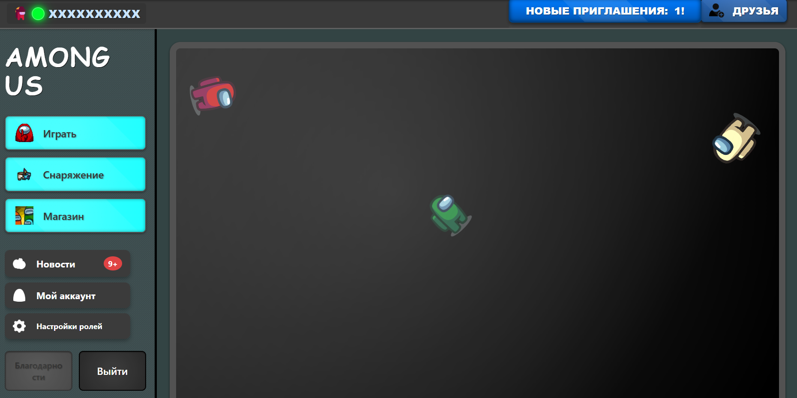
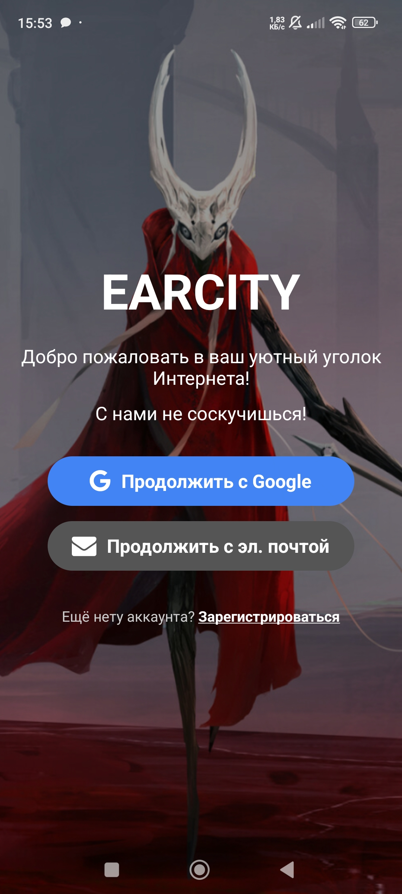
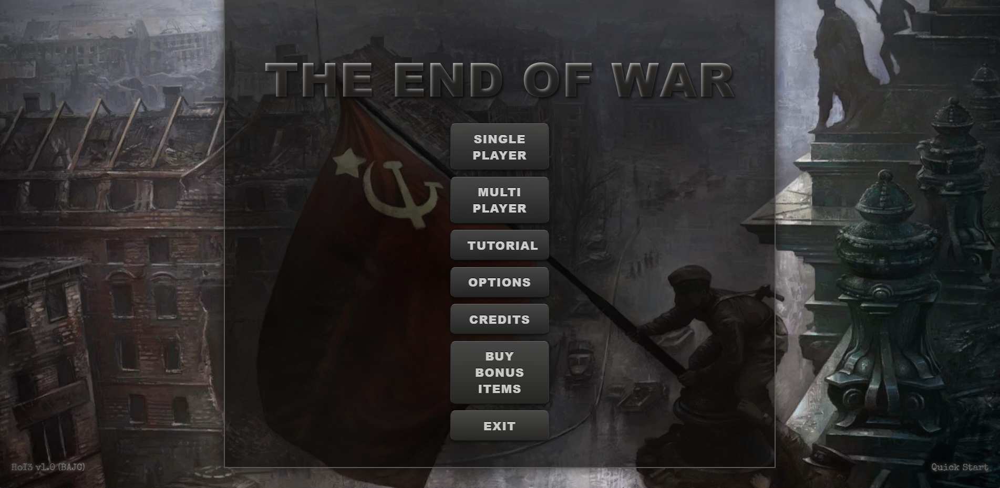
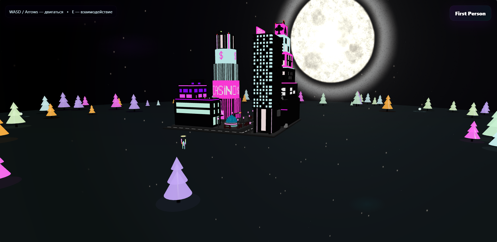

# Привет 👋, я **CatBox**
**Junior / Middle Frontend Developer** — люблю аккуратный интерфейс и продуктивный UX.

---

## 🌃 О себе
Я создаю аккуратные, отзывчивые и продуктивные интерфейсы. Работал с проектами на **React** и **React Native**, умею красиво верстать и люблю чистый код. Особое внимание уделяю деталям интерфейса: анимациям, микровзаимодействиям и понятной навигации.

**Коротко:** UX-minded, component-driven

---

## 🔧 Чем занимаюсь сейчас
- 🚀 Разрабатываю фронтенд-приложения на React / React Native  
- 🎨 Адаптивная и семантичная верстка (HTML/CSS/SCSS)  
- 🧩 Архитектура и TypeScript для масштабируемости  
- ⚡ Эксперименты с анимациями и UX-оптимизацией

---

## 🛠️ Технологии и инструменты
**Я работаю с:**

- **Языки:** JavaScript (ES6+), TypeScript  
- **UI / Libs:** React, React Native, Expo, Reanimated  
- **Верстка:** HTML5, CSS3, SCSS, Flexbox, Grid  
- **Инструменты:** Git, Vite, Webpack  
- **Дизайн:** Figma (основы), дизайн компонентов
- 
---

## 🚀 Избранные проекты

### 🔸 Among Us - Parody
**Описание:** Пародия на игру Among Us с мини-игрой "Кто убийца?".  
**Технологии:** React  
**Демо:** https://amongusparody.netlify.app/  

  

---

### 🔸 Earcity
**Описание:** Мобильное приложение-блог (Frontend).  
**Технологии:** React Native, LinearGradient, react-navigation  
**Репозиторий:** https://github.com/CatBox/earcity-tv  

  

---

### 🔸 LastWar - Strategy browser game
**Описание:** Браузерная стратегия с масштабируемой картой, юнитами и боевой системой.  
**Технологии:** React, CSS, SVG  
**Демо:** https://theendofwar.netlify.app/  

  

---

## 🖼️ Галерея — портфолио

  

---

## 📊 Что у меня в GitHub (статистика)
  

---

## ✉️ Контакты
- Email: eduardnigma28@gmail.com  
- Telegram / Twitter: @eduardNigma  
- Портфолио: https://catboxportfolio.netlify.app/

---

## 🧩 Немного обо мне (fun facts)
- ☕ Усидчивый и целеустремлённый.  
- 🎧 В наушниках — будь то код или музыка — всегда продуктивнее.  
- 🧠 Постоянно учусь: сейчас изучаю TypeScript.

---

