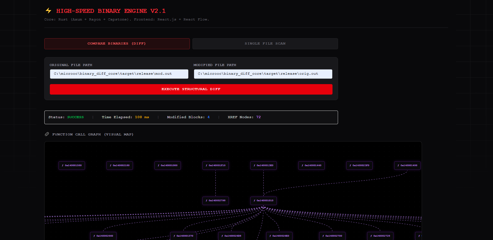
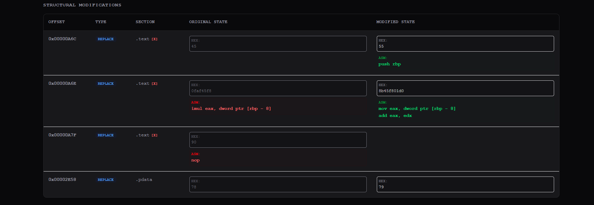
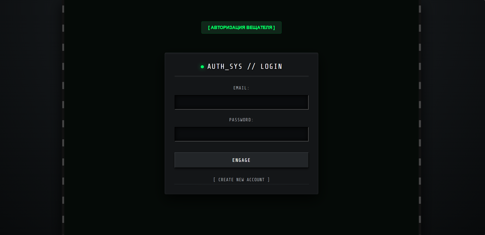
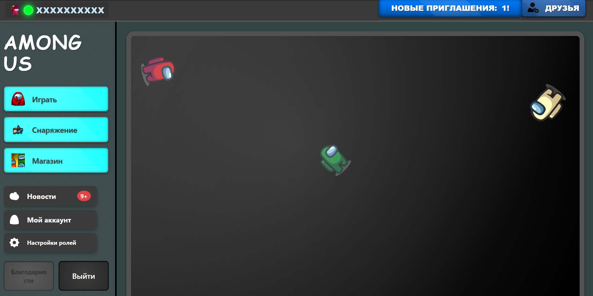
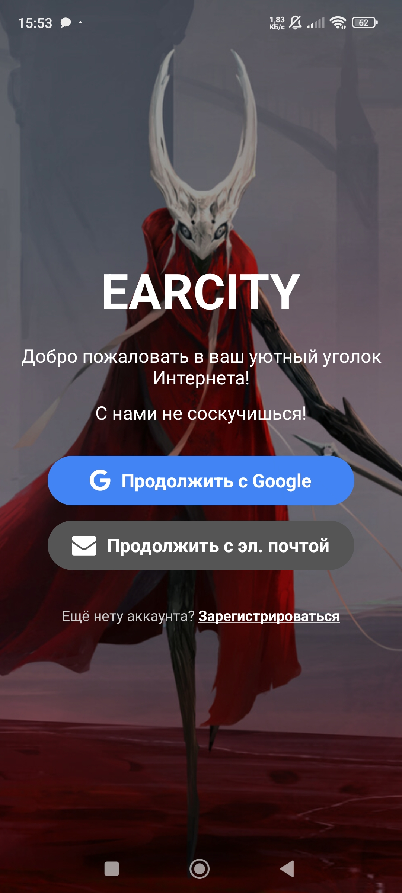
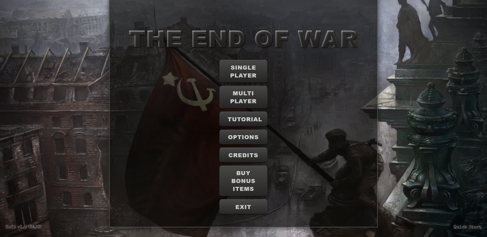
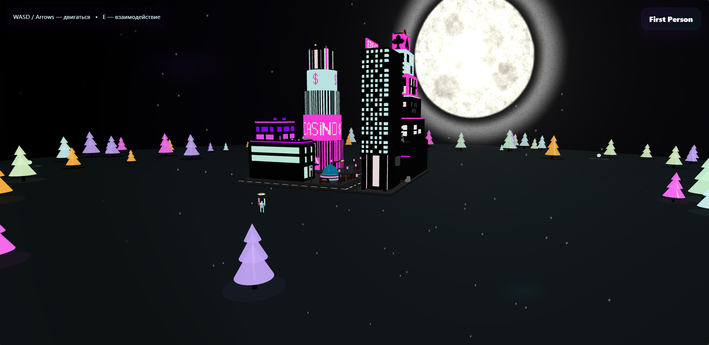

# Hi 👋, I'm **CatBox**
**Junior / Middle Frontend Developer** — passionate about clean interfaces and meaningful UX.

---

## 🌃 About Me
I love building clean, responsive, and user-friendly interfaces.  
I’ve worked on projects with **React** and **React Native**, enjoy writing clean, maintainable code, and pay close attention to the details that make an interface shine: animations, micro-interactions, and intuitive navigation.

**In short:** UX-focused, component-driven.

---

## 🔧 What I’m Working On
- 🚀 Developing modern frontend apps with React / React Native  
- 🦀 Expanding full-stack capabilities with Rust backend development
- 🎨 Crafting responsive & semantic layouts (HTML/CSS/SCSS)  
- 🧩 Scalable architecture with TypeScript  
- ⚡ Experimenting with real-time data streaming and WebRTC

---

## 🛠️ Tech Stack
**I work with:**

- **Languages:** JavaScript (ES6+), TypeScript, Rust, C++
- **UI / Libs:** React, React Native, Expo, Reanimated
- **Styling:** HTML5, CSS3, SCSS, Flexbox, Grid  
- **Tools / Protocols:** Git, Vite, Redux, Webpack, WebRTC, Web Audio API
- **Design:** Figma basics, component design  

---

## 🚀 Featured Projects

### 🔸 High-Speed Binary Engine V2.1
**Description:** A high-performance reverse engineering and binary diffing platform designed to analyze, decode, and compare executable files. It executes structural modifications analysis in milliseconds utilizing data parallelism and automatically maps out interactive, node-based function call graphs.  
**Tech:** Rust (Axum, Rayon, Capstone), React, React Flow  

  
  

---

### 🔸 Radio-Wave - WebRTC Radio Platform
**Description:** A real-time browser radio broadcasting platform featuring distinct broadcaster and listener roles, an advanced audio modulator, and a custom administrative dashboard for node management.  
**Tech:** React, Vite, Rust (Signaling Server), WebRTC, Web Audio API  
**Demo:** https://rosaura-rivetless-contendingly.ngrok-free.dev

  
  

---

### 🔸 Among Us - Parody
**Description:** A parody of Among Us with a mini-game *“Who’s the killer?”*.  
**Tech:** React  
**Demo:** https://amongusparody.netlify.app/  

  

---

### 🔸 Earcity
**Description:** A mobile blogging app (Frontend).  
**Tech:** React Native, LinearGradient, react-navigation  
**Download:** https://files.catbox.moe/ley6my.apk  

  

---

### 🔸 LastWar - Browser Strategy Game
**Description:** A browser-based strategy game with a scalable map, units, and a combat system.  
**Tech:** React, CSS, SVG  
**Demo:** https://theendofwar.netlify.app/  

  

---

## 🖼️ Portfolio Gallery

  

---

## 📊 GitHub Stats
  

---

## ✉️ Contact
- Email: eduardnigma28@gmail.com  
- Telegram / Twitter: @eduardNigma  
- Portfolio: https://catboxportfolio.netlify.app/  

---

## 🧩 Fun Facts
- ☕ Persistent and goal-driven  
- 🎧 Headphones on = max productivity (code or music)  
- 🧠 Lifelong learner — currently diving deeper into TypeScript and Full-Stack performance
